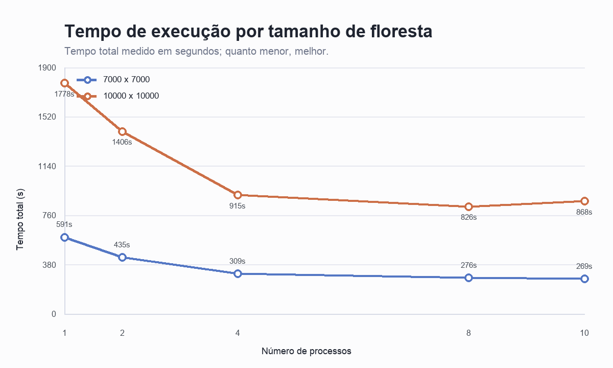
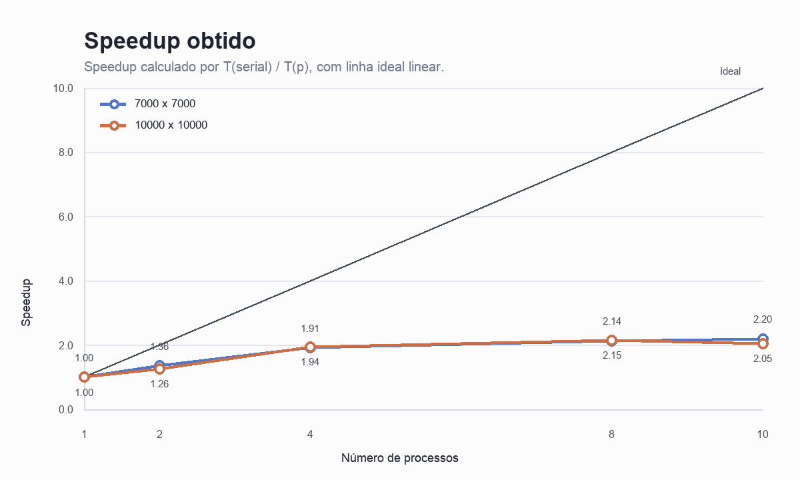
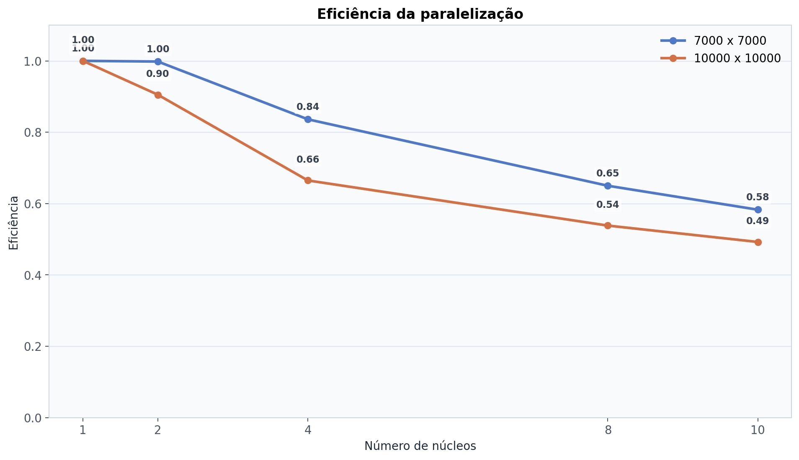

# Relatório da Atividade: Simulação Paralela de Incêndio Florestal

*Disciplina:* Programação Concorrente e Distribuída  
*Aluno(s):* Ellen e Letícia de Oliveira Barros  
*Turma:* Sistemas de Informação - 5º semestre  
*Professor:* Rafael Marconi  
*Data:* 08/04/2026  

---

# 1. Descrição do Problema

O projeto desenvolvido implementa uma simulação de propagação de incêndio florestal em uma grade bidimensional. A floresta é representada por uma matriz, na qual cada célula corresponde a uma pequena região do ambiente simulado.

Cada posição da matriz pode assumir um dos seguintes estados:

- vazio;
- árvore;
- fogo;
- queimado.

O objetivo do programa é acompanhar a evolução do fogo ao longo de vários passos de simulação. A cada passo, o algoritmo percorre a matriz e verifica o estado das células. Uma célula com árvore pode entrar em combustão quando existe fogo em sua vizinhança. Já uma célula que estava em chamas passa para o estado de queimada no passo seguinte.

Esse tipo de simulação possui relação direta com problemas reais. No Brasil, regiões como a Amazônia, o Cerrado e o Pantanal sofrem com queimadas recorrentes, que podem causar danos ambientais, sociais e econômicos. Embora o modelo implementado seja uma simplificação, ele permite compreender como técnicas computacionais podem ser utilizadas para estudar a propagação do fogo em grandes áreas.

Em aplicações reais, simulações desse tipo podem auxiliar na análise de risco, no planejamento de combate a incêndios, na definição de áreas prioritárias de monitoramento e no estudo do impacto da propagação do fogo sobre diferentes regiões de vegetação.

A paralelização foi aplicada porque o volume de dados processado é muito grande. Foram utilizadas entradas de `7000 x 7000` e `10000 x 10000`, o que corresponde, respectivamente, a 49.000.000 e 100.000.000 de células. Como cada passo da simulação precisa analisar a matriz, o custo computacional cresce rapidamente.

O algoritmo utilizado é uma simulação baseada em grade com atualização iterativa por vizinhança. A complexidade aproximada é:

```text
O(P * H * W)
```

Onde:

- `P` representa o número de passos executados;
- `H` representa a altura da matriz;
- `W` representa a largura da matriz.

O objetivo da paralelização é dividir o processamento da matriz entre diferentes núcleos, reduzindo o tempo total de execução quando comparado à versão sequencial.

---

# 2. Ambiente Experimental

Os experimentos foram realizados em um MacBook Air com 16 GB de memória RAM. O sistema possui 10 núcleos disponíveis para execução, conforme identificado pela própria aplicação durante os testes.

| Item | Descrição |
| --- | --- |
| Computador | MacBook Air |
| Processador | Apple Silicon |
| Número de núcleos disponíveis | 10 |
| Memória RAM | 16 GB |
| Sistema Operacional | macOS |
| Linguagem utilizada | Python |
| Bibliotecas utilizadas | NumPy e Numba |
| Estratégia de paralelização | Paralelização por múltiplos núcleos com Numba |
| Configurações testadas | Serial, 2, 4, 8 e 10 núcleos |

A execução serial foi utilizada como tempo base `T(1)` para o cálculo de speedup e eficiência.

---

# 3. Metodologia de Testes

O tempo de execução foi medido pela própria aplicação utilizando a função `time.perf_counter()` da linguagem Python. Essa função permite medir intervalos de tempo com boa precisão durante a execução do programa.

Foram utilizadas duas entradas principais:

- `7000 x 7000`, com 49.000.000 células;
- `10000 x 10000`, com 100.000.000 células.

Para cada entrada, foram realizadas execuções nas seguintes configurações:

- execução serial;
- execução paralela com 2 núcleos;
- execução paralela com 4 núcleos;
- execução paralela com 8 núcleos;
- execução paralela com 10 núcleos.

A densidade da floresta foi mantida em 75%, ou seja, aproximadamente 75% das células da grade representam árvores. Por isso, ao final da simulação, a quantidade de células queimadas fica próxima de 75% da matriz total, pois as células vazias não representam vegetação.

O tamanho da entrada foi mantido constante dentro de cada grupo de teste, permitindo comparar o impacto do aumento no número de núcleos sobre o tempo total de execução.

---

# 4. Resultados Experimentais

## 4.1 Entrada 7000 x 7000

Nesta entrada, a simulação processou uma matriz com 49.000.000 células.

| Configuração | Núcleos | Tempo total (s) | Tempo total (min) |
| --- | ---: | ---: | ---: |
| Serial | 1 | 596.37 | 9.94 |
| Paralelo | 2 | 298.77 | 4.98 |
| Paralelo | 4 | 178.32 | 2.97 |
| Paralelo | 8 | 114.71 | 1.91 |
| Paralelo | 10 | 102.34 | 1.71 |

## 4.2 Entrada 10000 x 10000

Nesta entrada, a simulação processou uma matriz com 100.000.000 células.

| Configuração | Núcleos | Tempo total (s) | Tempo total (min) |
| --- | ---: | ---: | ---: |
| Serial | 1 | 1676.49 | 27.94 |
| Paralelo | 2 | 926.25 | 15.44 |
| Paralelo | 4 | 630.53 | 10.51 |
| Paralelo | 8 | 389.39 | 6.49 |
| Paralelo | 10 | 340.56 | 5.68 |

---

# 5. Cálculo de Speedup e Eficiência

O speedup mede quantas vezes a execução paralela foi mais rápida que a execução serial.

```text
Speedup(p) = T(1) / T(p)
```

Onde:

- `T(1)` é o tempo da execução serial;
- `T(p)` é o tempo da execução com `p` núcleos.

A eficiência mede o aproveitamento dos núcleos utilizados.

```text
Eficiência(p) = Speedup(p) / p
```

Onde:

- `p` é o número de núcleos utilizados.

---

# 6. Tabela de Resultados

## 6.1 Entrada 7000 x 7000

| Configuração | Núcleos | Tempo (s) | Speedup | Eficiência |
| --- | ---: | ---: | ---: | ---: |
| Serial | 1 | 596.37 | 1.00 | 1.00 |
| Paralelo | 2 | 298.77 | 2.00 | 1.00 |
| Paralelo | 4 | 178.32 | 3.34 | 0.84 |
| Paralelo | 8 | 114.71 | 5.20 | 0.65 |
| Paralelo | 10 | 102.34 | 5.83 | 0.58 |

### Memorial de cálculo - 7000 x 7000

```text
T(1) = 596.37 s

Speedup(2) = 596.37 / 298.77 = 2.00
Eficiência(2) = 2.00 / 2 = 1.00

Speedup(4) = 596.37 / 178.32 = 3.34
Eficiência(4) = 3.34 / 4 = 0.84

Speedup(8) = 596.37 / 114.71 = 5.20
Eficiência(8) = 5.20 / 8 = 0.65

Speedup(10) = 596.37 / 102.34 = 5.83
Eficiência(10) = 5.83 / 10 = 0.58
```

## 6.2 Entrada 10000 x 10000

| Configuração | Núcleos | Tempo (s) | Speedup | Eficiência |
| --- | ---: | ---: | ---: | ---: |
| Serial | 1 | 1676.49 | 1.00 | 1.00 |
| Paralelo | 2 | 926.25 | 1.81 | 0.90 |
| Paralelo | 4 | 630.53 | 2.66 | 0.66 |
| Paralelo | 8 | 389.39 | 4.31 | 0.54 |
| Paralelo | 10 | 340.56 | 4.92 | 0.49 |

### Memorial de cálculo - 10000 x 10000

```text
T(1) = 1676.49 s

Speedup(2) = 1676.49 / 926.25 = 1.81
Eficiência(2) = 1.81 / 2 = 0.90

Speedup(4) = 1676.49 / 630.53 = 2.66
Eficiência(4) = 2.66 / 4 = 0.66

Speedup(8) = 1676.49 / 389.39 = 4.31
Eficiência(8) = 4.31 / 8 = 0.54

Speedup(10) = 1676.49 / 340.56 = 4.92
Eficiência(10) = 4.92 / 10 = 0.49
```

---

# 7. Gráfico de Tempo de Execução

O gráfico abaixo apresenta o tempo total de execução em função do número de núcleos utilizados.

Observa-se que, nas duas entradas, o aumento no número de núcleos reduziu o tempo total de execução. A redução foi mais evidente nas configurações com maior número de núcleos, principalmente na entrada `10000 x 10000`.



---

# 8. Gráfico de Speedup

O gráfico abaixo apresenta o speedup obtido em cada configuração, comparando os tempos paralelos com a execução serial.

A linha ideal representa o comportamento esperado em uma paralelização perfeita. Nesse caso, o speedup cresceria proporcionalmente ao número de núcleos. Na prática, os resultados ficaram abaixo da linha ideal, mas ainda apresentaram ganho significativo.



---

# 9. Gráfico de Eficiência

O gráfico abaixo apresenta a eficiência da paralelização.

A eficiência tende a diminuir conforme o número de núcleos aumenta. Isso ocorre porque, embora mais núcleos estejam disponíveis, também aumenta o custo de coordenação, sincronização e acesso à memória.



---

# 10. Análise dos Resultados

Os resultados mostram que a paralelização trouxe ganho significativo de desempenho nas duas entradas testadas.

Na entrada `7000 x 7000`, o tempo de execução caiu de 596.37 segundos na versão serial para 102.34 segundos com 10 núcleos. Isso representa uma redução de aproximadamente 9.94 minutos para 1.71 minuto. O speedup obtido com 10 núcleos foi de 5.83.

Na entrada `10000 x 10000`, o tempo caiu de 1676.49 segundos na versão serial para 340.56 segundos com 10 núcleos. Isso representa uma redução de aproximadamente 27.94 minutos para 5.68 minutos. O speedup obtido com 10 núcleos foi de 4.92.

Embora o speedup não tenha sido linear, os resultados demonstram que o paralelismo foi eficaz. Em uma situação ideal, o uso de 10 núcleos poderia gerar um speedup próximo de 10. No entanto, na prática, existem limitações que impedem esse crescimento perfeito.

Entre os principais fatores que explicam essa diferença estão:

- custo de criação e gerenciamento das tarefas paralelas;
- sincronização necessária entre os passos da simulação;
- acesso intenso à memória;
- leitura e escrita de matrizes muito grandes;
- disputa por cache e largura de banda de memória;
- partes do algoritmo que não escalam perfeitamente;
- overhead causado pela coordenação entre os núcleos.

Mesmo com essas limitações, a redução do tempo total foi expressiva. O caso mais relevante foi a entrada `10000 x 10000`, em que a execução passou de 27.94 minutos para 5.68 minutos. Isso mostra que o paralelismo se torna especialmente importante em problemas com grande volume de dados.

Outro ponto observado é que a eficiência diminui conforme mais núcleos são utilizados. Esse comportamento é esperado em aplicações paralelas, pois o ganho adicional tende a ser menor à medida que o número de núcleos cresce. Ainda assim, os resultados indicam que o uso de múltiplos núcleos foi vantajoso para o problema estudado.

No contexto de uma simulação ambiental, esse ganho é importante. Em cenários reais, como o estudo de incêndios em grandes regiões de vegetação brasileira, a capacidade de processar grandes matrizes em menos tempo pode contribuir para análises mais rápidas e para o planejamento de estratégias de prevenção e combate.

---

# 11. Conclusão

O projeto implementou uma simulação de propagação de incêndio florestal em grade bidimensional, comparando a execução serial com a execução paralela. A aplicação utilizou Python, NumPy e Numba para processar matrizes de grande dimensão e distribuir o trabalho entre múltiplos núcleos.

Os resultados demonstraram que a paralelização reduziu de forma significativa o tempo de execução. Na entrada `7000 x 7000`, o tempo caiu de 596.37 segundos para 102.34 segundos com 10 núcleos. Na entrada `10000 x 10000`, o tempo caiu de 1676.49 segundos para 340.56 segundos com 10 núcleos.

O maior ganho absoluto ocorreu na entrada `10000 x 10000`, reduzindo o tempo de aproximadamente 27.94 minutos para 5.68 minutos. Isso evidencia que o paralelismo é especialmente útil quando o volume de dados é elevado.

Apesar disso, o speedup não foi linear. A eficiência diminuiu conforme o número de núcleos aumentou, o que é esperado devido ao overhead de paralelização, ao acesso à memória e às limitações naturais do algoritmo.

Como melhorias futuras, poderiam ser realizadas:

- repetir cada configuração mais de uma vez e calcular a média dos tempos;
- testar a aplicação em máquinas com mais núcleos;
- analisar o consumo de CPU e memória durante a execução;
- otimizar ainda mais o acesso às matrizes;
- comparar diferentes estratégias de divisão da grade;
- testar outras abordagens de alto desempenho.

Conclui-se que a paralelização foi eficaz para melhorar o desempenho da simulação. O trabalho demonstra a importância da programação concorrente e distribuída em problemas computacionais de grande escala, especialmente em aplicações relacionadas a fenômenos ambientais, como a propagação de incêndios florestais.
