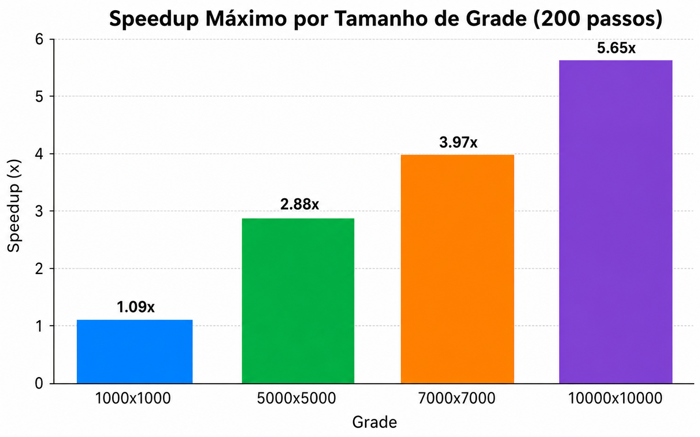
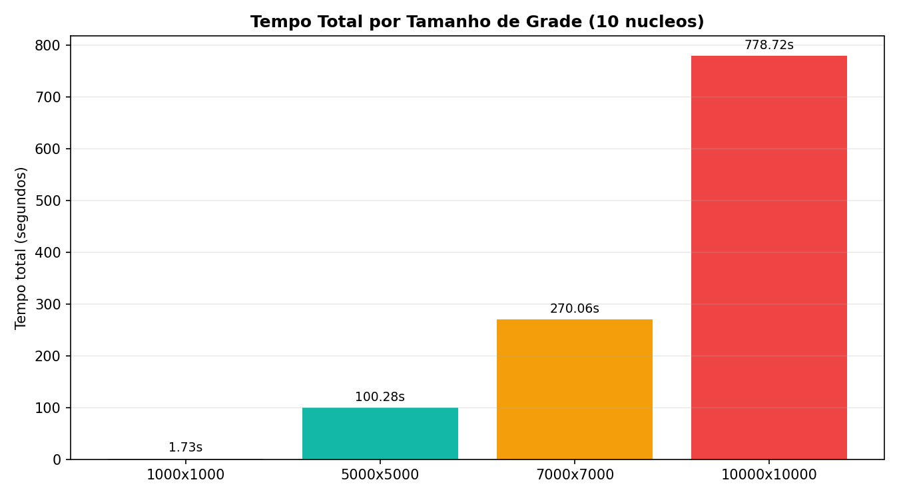
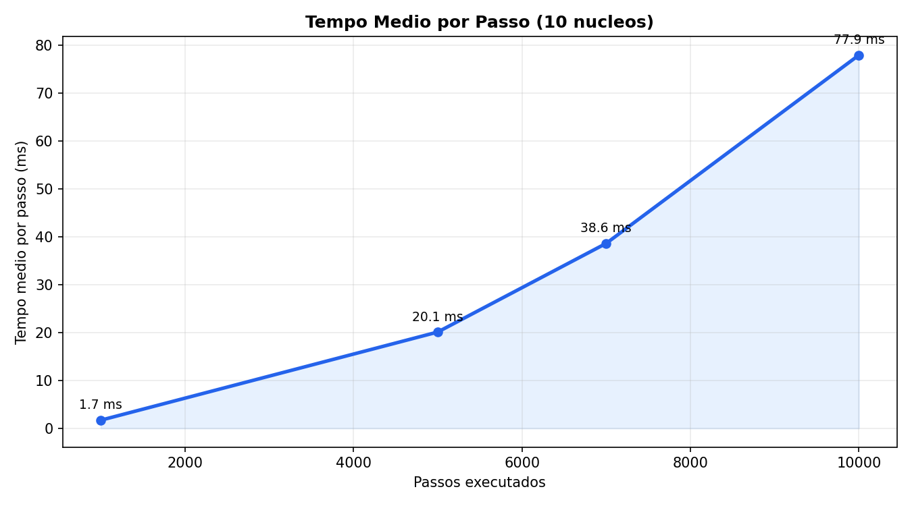

# Simulação de Incêndio Florestal

Simulador de propagação de incêndio em grade 2D com foco em desempenho, incluindo:
- execução sequencial (NumPy),
- execução paralela com `multiprocessing` + `shared_memory`,
- execução via terminal (simulador_cli.py)

## Objetivo do projeto

Modelar a propagação do fogo em uma floresta discretizada, comparando desempenho entre abordagens sequenciais e paralelas em grades grandes.

## Estrutura do projeto

- `floresta.py`: geração da grade inicial e ignição do fogo.
- `propagacao.py`: regras de atualização e kernels (NumPy e Numba opcional).
- `paralelo.py`: coordenação paralela com `Pool` e double buffering em memória compartilhada.
- `simulador_cli.py`: execução em terminal + benchmark.

## Requisitos

- Python 3.10+
- Dependências:
  - `numpy`
  - `matplotlib`
  - `numba` (opcional, recomendado para acelerar kernel)

## Instalação

```bash
python3 -m venv .venv
source .venv/bin/activate
```

## Como executar

### 1) Modo terminal (CLI)

```bash
python3 simulador_cli.py
```

O programa pergunta quantos núcleos usar e executa a simulação em modo paralelo por padrão.

## Modelo da simulação

Estados por célula:
- `0`: vazio
- `1`: árvore
- `2`: fogo
- `3`: queimado

Dinâmica geral:
- célula em fogo vira queimada no próximo passo;
- árvore pode pegar fogo se houver vizinhos em combustão;
- probabilidade e fatores locais controlam intensidade da propagação.

## Arquitetura de paralelismo

- Shared memory (`multiprocessing.shared_memory`) para evitar cópia integral da grade entre processos.
- Double buffering real (`buffer A`/`buffer B`) alternado a cada passo.
- Divisão da grade em faixas de linhas por processo.
- Suporte a Numba no kernel quando disponível.

 ## Análise dos resultados (200 passos)

| Grade | Passos | Núcleos testados | Tempo Sequencial (s) | Melhor tempo Paralelo (s) | Núcleos do melhor paralelo | Speedup máximo |
|---|---:|---|---:|---:|---:|---:|
| 1000x1000 | 200 | 1,2,4,8,10 | 0.756s | 0.692s | 4 | 1.09x |
| 5000x5000 | 200 | 1,2,4,8,10 | 16.197s | 5.626s | 8 | 2.88x |
| 7000x7000 | 200 | 1,2,4,8,10 | 31.911s | 8.038s | 10 | 3.97x |
| 10000x10000 | 200 | 1,2,4,8,10 | 77.431s | 13.698s | 8 | 5.65x |

### Speedup máximo por grade (200 passos)



Os resultados mostram que o benefício do paralelismo depende diretamente do tamanho da grade:

- Em **1000x1000**, o ganho foi pequeno (**speedup máximo de 1.09x com 4 núcleos**), indicando que o overhead de criação/sincronização de processos quase anula a vantagem paralela.
- Em **5000x5000**, o paralelismo já se torna claramente vantajoso (**2.88x com 8 núcleos**).
- Em **7000x7000**, o melhor resultado foi com **10 núcleos** (**3.97x**).
- Em **10000x10000**, ocorreu o maior ganho geral: **5.65x com 8 núcleos**.

Em resumo, **o melhor cenário geral foi a grade 10000x10000**, com o maior speedup observado.  
Também se nota que, em alguns casos, aumentar de 8 para 10 núcleos não melhora mais o tempo (ou melhora muito pouco), o que sugere saturação por overhead de paralelismo.

## Benchmark (10 núcleos)

Todos os testes abaixo foram executados com **10 núcleos** no modo paralelo.

| Grade | Células totais | Passos executados | Tempo total (s) | Tempo total (min) | Tempo médio por passo |
|---|---:|---:|---:|---:|---:|
| 1000 x 1000 | 1.000.000 | 1000 | 1,73s | 0,03 min | 1,7 ms |
| 5000 x 5000 | 25.000.000 | 5000 | 100,28s | 1,67 min | 20,1 ms |
| 7000 x 7000 | 49.000.000 | 7000 | 270,06s | 4,50 min | 38,6 ms |
| 10000 x 10000 | 100.000.000 | 10000 | 778,72s | 12,98 min | 77,9 ms |

## Gráficos de desempenho

### Tempo total por grade



### Tempo médio por passo



## Conclusões

- O tempo cresce de forma consistente com o aumento da grade e dos passos.
- Em grades muito grandes, o custo de memória e sincronização fica dominante.
- Mesmo com 10 núcleos, simulações de 100 milhões de células podem levar vários minutos.

## Observações práticas

- Para demonstração rápida: `1000x1000`.
- Para testes intermediários: `5000x5000` ou `7000x7000`.
- Para carga alta: `10000x10000` com maior tempo de execução.

---

Projeto voltado a estudo de paralelismo, modelagem em grade e análise de desempenho computacional.
